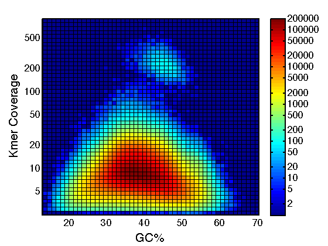

## Organellar Genomes of Sitka Spruce (*Picea sitchensis*) Assembly and Annotation

**Shaun Jackman** [\@sjackman][]

Benjamin P Vandervalk, Rene L Warren, Hamid Mohamadi, Justin Chu, Sarah Yeo, Lauren Coombe, Stephen Pleasance, Robin J Coope, Joerg Bohlmann, Steven JM Jones, Inanc Birol

2017-01-15

<https://sjackman.ca/picea-sitchensis-organelles-slides>

[][cc-by]

[\@sjackman]: http://twitter.com/sjackman
[cc-by]: http://creativecommons.org/licenses/by/4.0/

## Shaun Jackman

| [BCCA Genome Sciences Centre][]
| Vancouver, Canada
| [\@sjackman][] | [github.com/sjackman][] | [sjackman.ca][]

[BCCA Genome Sciences Centre]: http://bcgsc.ca
[github.com/sjackman]: https://github.com/sjackman
[sjackman.ca]: http://sjackman.ca

Background
================================================================================

## Conifer Genomics

+ Conifer genomes are large, about twenty gigabases
+ Before 2013 no conifer genomes had been published
+ Then three in the period of one year!
    + Loblolly pine (Neale et al. 2014)
    + Norway spruce (Nystedt et al. 2013)
    + White spruce (Birol et al. 2013)

## Genome Skimming

+ Whole genome sequencing data contains both nuclear and organellar reads
+ Each cell contains hundreds of mitochondria and plastids
+ Reads of the organellar genomes are abundant
+ Organellar sequences assemble well with a single lane
+ Single-copy nuclear sequences are too low depth to assemble well

----------------------------------------

## Classification

+ Assembly is composed of
    + organellar sequence
	+ nuclear repeat elements
	+ contamination
+ Identify putative organellar sequences by
    + homology to known organellar sequences
    + depth of coverage
    + length
    + GC content

## Work so far

+ Assembled and published the annotated sequences of \
  complete **white spruce plastid** genome \
  draft **white spruce mitochondrial** genome \
  (Jackman et al. 2015)
+ Assembled and published the annotated sequence of \
  complete **Sitka spruce plastid** genome \
  (Coombe et al. 2016)
+ Currently working to assemble and annotate the \
  draft **Sitka spruce mitochondrial** genome

## White Spruce Organelles

+ Illumina paired-end
    + One 2x300 MiSeq lane for the plastid
    + One 2x150 HiSeq lane for the mitochondrion
+ Illumina mate-pair for scaffolding
+ Assemble with [ABySS][]
    + Complete plastid genome in one contig
	+ Draft mitochondrial genome in 36 scaffolds
+ Close gaps with [Sealer][]
+ Polish with [Pilon][]
+ Annotate genes with [Maker][] and [Prokka][]
+ Manual annotation of difficult genes
    + Three genes with short initial exons < 10 bp
    + One trans-spliced gene (*rps12*)

----------------------------------------

----------------------------------------

10x Genomics Chromium
================================================================================

----------------------------------------

----------------------------------------

## Sitka Spruce Plastid

+ One lane of Illumina 2x150 HiSeq of 10x GemCode
+ One library rather than two: \
  Illumina paired-end and mate-pair
+ Assemble with [ABySS][]
+ Scaffold with [ARCS][] and [LINKS][]
+ Close gaps with [Sealer][]
+ Polish with [Pilon][]
+ Annotate with [Maker][]
+ Manual annotation of difficult genes
+ Complete plastid genome in one contig
+ Perfect synteny to white spruce plastid

----------------------------------------

Sitka Spruce Mitochondrion
================================================================================

## Aim

Assemble the Sitka spruce mitochondrion into a single scaffold\* using 10x Chromium data and annotate it.

\* if it has a single chromosome

## Method

+ Align Sitka spruce reads to white spruce organelles with [LongRanger][]
+ Identify 10x barcodes that contain at least one mitochondrial molecule
    + Four properly-paired mitochondrial reads
+ Assemble these mitochondrial barcodes with [ABySS][]
+ Scaffold with [ARCS][] and [LINKS][]
+ Annotate genes with [MAKER][] and [Prokka][]

## Results

+ Largest scaffold is 1.2 Mbp
+ 50% of the 6 Mbp genome in 4 scaffolds > 460 kbp
+ 75% of the genome in 13 scaffolds > 100 kbp
+ 1/223 or 0.45% of reads are mitochondrial
+ 115 ORFs with similarity to known mitochondrial genes
+ 1,154 other ORFS ≥ 300 bp
+ 9 Type II introns in 6 genes

----------------------------------------

fin
================================================================================

## Shaun Jackman

| [BCCA Genome Sciences Centre][]
| Vancouver, Canada
| [\@sjackman][] | [github.com/sjackman][] | [sjackman.ca][]

**Slides** \
<https://sjackman.ca/picea-sitchensis-organelles-slides>

**Markdown source code** \
[https://github.com/sjackman/ \
picea-sitchensis-organelles-slides](https://github.com/sjackman/picea-sitchensis-organelles-slides)

## Links

[ABySS][]
&middot; [ARCS][]
&middot; [Architect][]
&middot; [Fragscaff][]
&middot; [LINKS][]
&middot; [LongRanger][]
&middot; [MAKER][]
&middot; [Pilon][]
&middot; [Prokka][]
&middot; [RNAweasel][]
&middot; [Sealer][]
&middot; [Supernova][]

[ABySS]: https://github.com/bcgsc/abyss
[ARCS]: https://github.com/bcgsc/arcs
[Architect]: https://github.com/kuleshov/architect
[Fragscaff]: http://krishna.gs.washington.edu/software.html
[Kollector]: https://github.com/bcgsc/kollector
[LINKS]: https://github.com/warrenlr/LINKS
[LongRanger]: https://support.10xgenomics.com/genome-exome/software/pipelines/latest/what-is-long-ranger
[MAKER]: http://www.yandell-lab.org/software/maker.html
[Pilon]: http://www.broadinstitute.org/software/pilon/]
[Prokka]: http://www.vicbioinformatics.com/software.prokka.shtml
[RNAweasel]: http://megasun.bch.umontreal.ca/RNAweasel/
[Sealer]: https://github.com/bcgsc/abyss/tree/master/Sealer
[Supernova]: http://support.10xgenomics.com/de-novo-assembly/software/overview/welcome

Supplementary Slides
================================================================================

## Future Work

+ Identify mitochondrial barcodes using the draft sitka spruce assembly rather than white spruce assembly
+ Fill gaps with [Sealer][] and [Kollector][]
+ Polish with [Pilon][]
+ Identify introns genome-wide using [RNAweasel][]
+ Assemble with 10x Genomics [Supernova][]

----------------------------------------

| Read Metrics                    | Plastid         | Mitochondrion
|---------------------------------|-----------------|--------------
| Number of HiSeq lanes           | 1 GemCode lane  | 1 Chromium lane
| Read length                     | 2 x 125 bp      | 2 x 150 bp
| Number of read                  | 630 million     | 843 million
| Number selected for assembly    | 4.3 million     | 119 million
| Number mapped to assembly       | 15,232 of 4.3 M | 3.78 M of 843 M
| Proportion of organellar reads  | 1/283 0.35%     | 1/223 or 0.45%
| Depth of coverage               | 17x             | 40x

----------------------------------------

| Assembly Metrics                | Plastid         | Mitochondrion
|---------------------------------|-----------------|--------------
| Assembled genome size           | 124,029 bp      | 6.09 Mbp
| Number of contigs               | 1 contig        | 1,216 contigs
| Contig N50                      | 124 kbp         | 13.7 kbp
| Number of scaffolds             | 1 scaffold      | 239 scaffolds
| Scaffold N50                    | 124 kbp         | 461 kbp
| Largest scaffold                | 124 kbp         | 1,223 kbp
| GC content                      | 38.8%           | 43.6%

----------------------------------------

| Annotation Metrics          | Plastid   | Mitochondrion
|-----------------------------|-----------|--------------
| Number of genes w/o ORFS    | 114 (108) | 115 (67)
| Protein-coding genes (mRNA) | 74 (72)   | 84 (47)
| rRNA genes                  | 4 (4)     | 3 (2)
| tRNA genes                  | 36 (32)   | 25 (18)
| ORFs ≥ 300 bp               | 4         | 1,154
| Introns in coding genes     | 9 (8)     | 9 (6)
| Introns in tRNA genes       | 6 (6)     | 0

## Scaffolding Tools for 10x

+ [ARCS][] with [LINKS][]
+ [Architect][] \
  intended for synthetic long reads
+ [Fragscaff][] \
  intended for contiguity-preserving transposition
