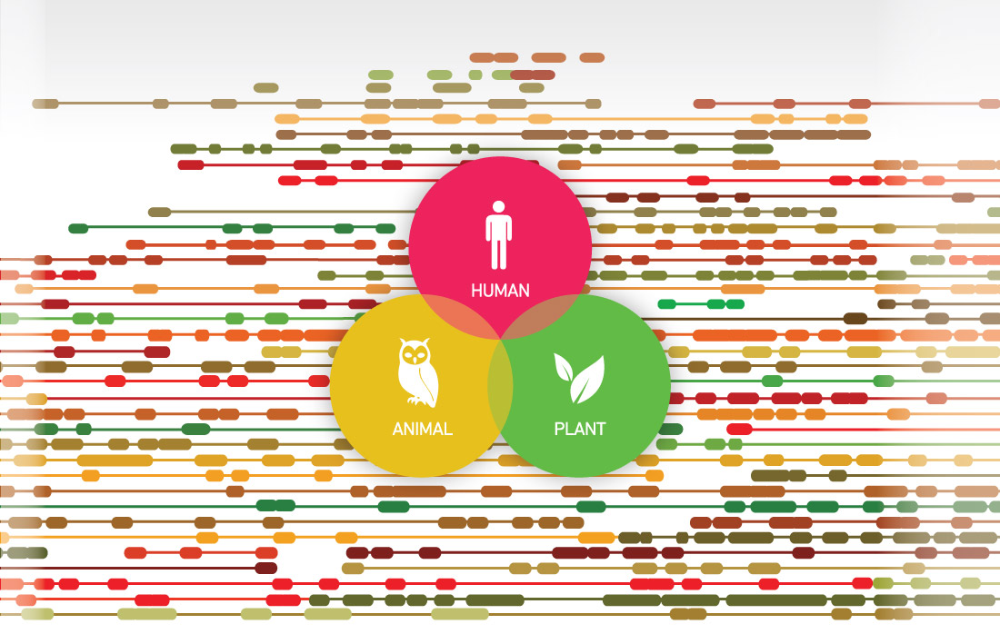
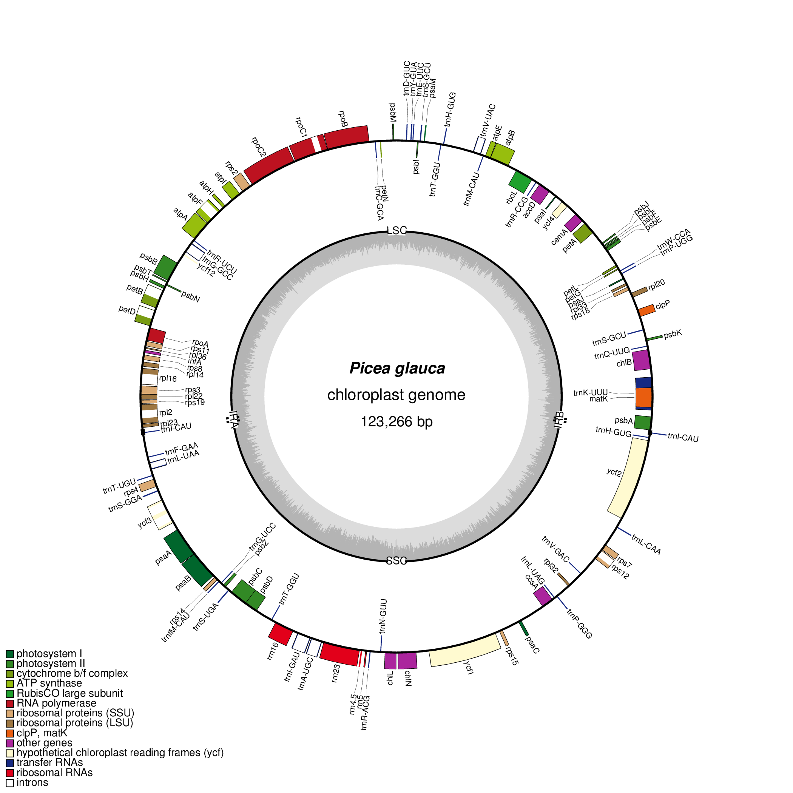
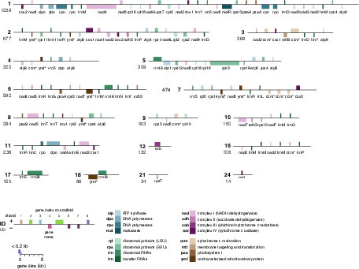
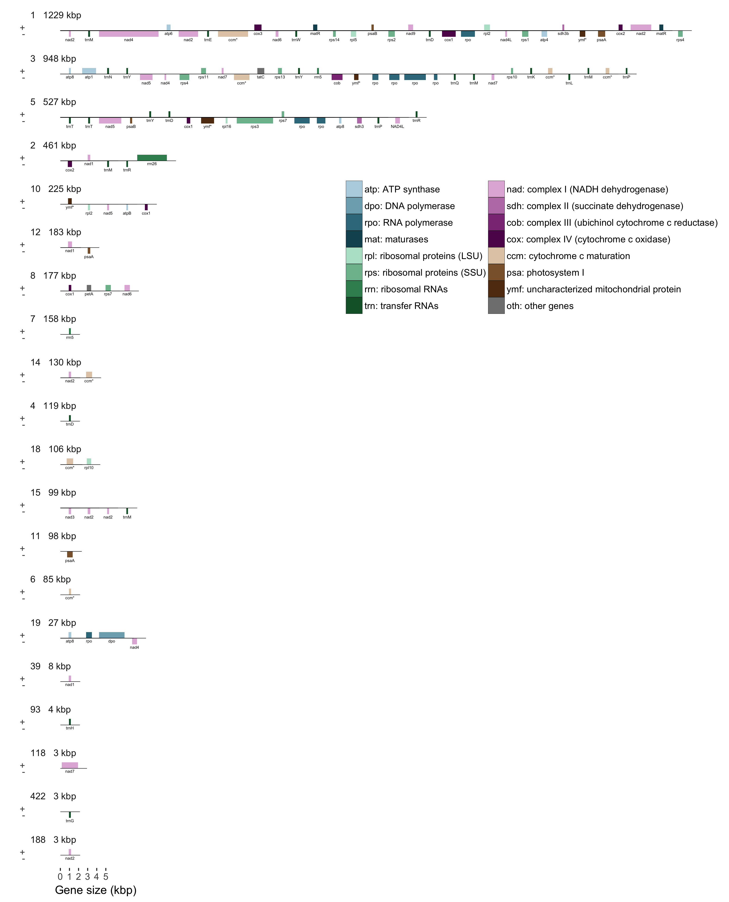

## Organellar Genomes of Sitka Spruce (*Picea sitchensis*) Assembly and Annotation

Shaun Jackman [\@sjackman][]

2017-01-15

[][cc-by]

[Fork me on GitHub!][]

[\@sjackman]: http://twitter.com/sjackman
[cc-by]: http://creativecommons.org/licenses/by/4.0/
[Fork me on GitHub!]: https://github.com/sjackman/picea-sitchensis-organelles-slides

## Shaun Jackman

| [BC Cancer Agency Genome Sciences Centre][]
| Vancouver, Canada
| [\@sjackman][] | [github.com/sjackman][] | [sjackman.ca][]

[BC Cancer Agency Genome Sciences Centre]: http://bcgsc.ca
[github.com/sjackman]: https://github.com/sjackman
[sjackman.ca]: http://sjackman.ca

Synopsis
================================================================================

## Genome Skimming

+ The SMarTForests consortium published the draft sequence of the 20 gigabase white spruce genome (Birol et al. 2013)
+ Whole genome sequencing data contains reads from both the nuclear and organellar genomes
+ Reads of the organellar genomes are abundant, because each cell contains hundreds of mitochondria and plastids

## Assembly with 10x Genomics

+ One lane of HiSeq 10x Gemcode data assembles the **124 kbp plastid genome**
+ One lane of HiSeq 10x Chromium data assembles the estimated **6 Mbp mitochondrial genome**
+ The assembly is composed of **organellar sequence** as well as **nuclear repeat elements**
+ The organellar sequences are separated from the assembly by **classifying the sequences** using their **length, depth of coverage, GC content, and homology**

## Work so far

+ The assembled organellar genomes were annotated for their coding genes, ribosomal RNA (rRNA), and transfer RNA (tRNA)
+ We assembled and published the complete annotated sequence of the **white spruce spruce plastid genome** and **draft white spruce mitochondrial genome** \
  (Jackman et al. 2015)
+ We assembled and published the complete annotated sequence of the **Sitka spruce plastid genome** \
  (Coombe et al. 2016)
+ We are currently working to assemble and annotate the **Sitka spruce mitochondrial genome**

10x Genomics Chromium
================================================================================

----------------------------------------

## Assemble Chromium

+ [Supernova][]
+ [ABySS][] for contigs, scaffolding is under way

## Scaffold with Chromium

+ [Fragscaff][] <small>(intended for an older technology)</small>
+ [Architect][]
+ BCGSC [ARCS][] with [LINKS][]

[ABySS]: https://github.com/bcgsc/abyss
[Architect]: https://github.com/kuleshov/architect
[ARCS]: https://github.com/bcgsc/arcs
[Fragscaff]: http://krishna.gs.washington.edu/software.html
[LINKS]: https://github.com/warrenlr/LINKS
[Supernova]: http://support.10xgenomics.com/de-novo-assembly/software/overview/welcome

----------------------------------------

Spruce Organelles Assembly and Annotation
================================================================================

## White Spruce Organelles

+ Illumina paired-end
    + One 2x300 MiSeq lane for the plastid
    + One 2x150 HiSeq lane for the mitochondrion
+ Illumina mate-pair for scaffolding
+ Assemble with [ABySS][]
    + Complete plastid genome in one contig
	+ Draft mitochondrial genome in 36 scaffolds
+ Close gaps with [Sealer][]
+ Polish with [Pilon][]
+ Annotate genes with [Maker][] and [Prokka][]
+ Manual annotation of difficult genes
    + Three genes with short initial exons < 10 bp
    + One trans-spliced gene (*rps12*)

----------------------------------------

----------------------------------------

## Sitka Spruce Plastid

+ Illumina 2x150 HiSeq of 10x GemCode
    + One library compared to both Illumina paired-end and mate-pair
+ Assemble with [ABySS][] to assemble
+ Scaffold with [ARCS][] and [LINKS][]
+ Complete plastid genome in one contig
+ Close gaps with [Sealer][]
+ Polish with [Pilon][]
+ Annotate with [Maker][]
+ Manual annotation of difficult genes
    + Three genes with short initial exons < 10 bp
    + One trans-spliced gene (*rps12*)
+ Perfect synteny to white spruce plastid

----------------------------------------

Sitka Spruce Mitochondrion
================================================================================

## Aim

Assemble the Sitka spruce mitochondrion into a single scaffold\* using 10x Chromium data and annotate it.

\* if it has a single chromosome

## Method

+ Align Sitka spruce reads to white spruce organelles with [LongRanger][]
+ Identify 10x barcodes that contain at least one mitochondrial molecule
    + Four properly-paired mitochondrial reads
+ Assemble these mitochondrial barcodes with [ABySS][]
+ Scaffold with [ARCS][] and [LINKS][]
+ Annotate genes with [MAKER][] and [Prokka][]

[LongRanger]: https://support.10xgenomics.com/genome-exome/software/pipelines/latest/what-is-long-ranger

----------------------------------------

## To do

+ Identify mitochondrial barcodes using the draft sitka spruce assembly rather than white spruce assembly
+ Fill gaps with [Sealer][] and [Kollector][]
+ Polish with [Pilon][]
+ Identify introns using [RNAweasel][]
+ Assemble with [Supernova][]
+ Submit to NCBI GenBank

[Kollector]: https://github.com/bcgsc/kollector
[MAKER]: http://www.yandell-lab.org/software/maker.html
[Pilon]: http://www.broadinstitute.org/software/pilon/]
[Prokka]: http://www.vicbioinformatics.com/software.prokka.shtml
[RNAweasel]: http://megasun.bch.umontreal.ca/RNAweasel/
[Sealer]: https://github.com/bcgsc/abyss/tree/master/Sealer

Results
================================================================================

----------------------------------------

| Read Metrics                    | Plastid         | Mitochondrion
|---------------------------------|-----------------|--------------
| Number of HiSeq lanes           | 1 GemCode lane  | 1 Chromium lane
| Read length                     | 2 x 125 bp      | 2 x 150 bp
| Number of read                  | 630 million     | 843 million
| Number selected for assembly    | 4.3 million     | 119 million
| Number mapped to assembly       | 15,232 of 4.3 M | 3.78 M of 843 M
| Proportion of organellar reads  | 1/283 0.35%     | 1/223 or 0.45%
| Depth of coverage               | 17x             | 40x

----------------------------------------

| Assembly Metrics                | Plastid         | Mitochondrion
|---------------------------------|-----------------|--------------
| Assembled genome size           | 124,029 bp      | 6.09 Mbp
| Number of contigs               | 1 contig        | 1,216 contigs
| Contig N50                      | 124 kbp         | 13.7 kbp
| Number of scaffolds             | 1 scaffold      | 239 scaffolds
| Scaffold N50                    | 124 kbp         | 461 kbp
| Largest scaffold                | 124 kbp         | 1,223 kbp
| GC content                      | 38.8%           | 43.6%

----------------------------------------

| Annotation Metrics          | Plastid   | Mitochondrion
|-----------------------------|-----------|--------------
| Number of genes w/o ORFS    | 114 (108) | 115 (67)
| Protein-coding genes (mRNA) | 74 (72)   | 84 (47)
| rRNA genes                  | 4 (4)     | 3 (2)
| tRNA genes                  | 36 (32)   | 25 (18)
| ORFs ≥ 300 bp               | 4         | 1,154
| Introns in coding genes     | 9 (8)     | 9 (6)
| Introns in tRNA genes       | 6 (6)     | 0

fin
================================================================================

## Links

[ABySS][] | [ARCS][] | [Architect][] | [Fragscaff][] | | [LINKS][] | [MAKER][] | [Pilon][] | [Prokka][] | [Sealer][] | [Supernova][]

## Shaun Jackman

| [BC Cancer Agency Genome Sciences Centre][]
| Vancouver, Canada
| [\@sjackman][] | [github.com/sjackman][] | [sjackman.ca][]

